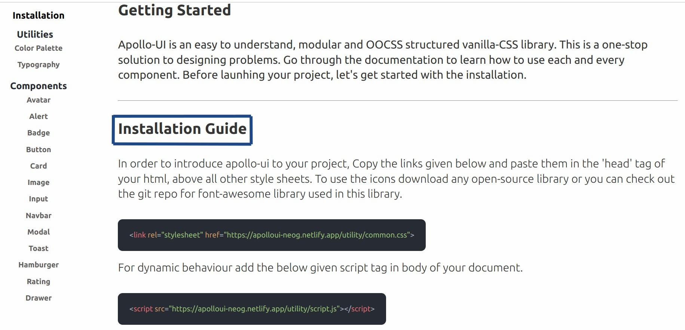
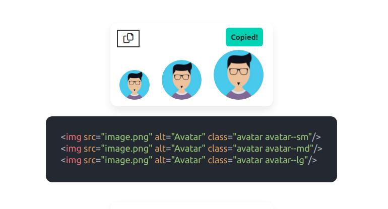

## Apollo-UI

Apollo-UI is a one stop solutions to all your styling needs. It is modular, clean and integrates smoothly with any framework and library. All the elements are made using HTML, Vanilla CSS and Vanilla JS. Go through this documentaion to learn more about each component and how to use them.

[Apollo-UI](https://apolloui-neog.netlify.app)

### Components added:
* Alert
* Avatar
* Badge
* Button
* Card
* Hamburger menu(Sidebar)
* Image
* Input
* Modal
* Navbar
* Toast
* Rating Field
* Drawer

### How to use this library?
In order to apply apollo-ui components to your project, copy the below link tags and place them inside the head tag of your html, above all other imported style sheets. First tag imports the styling from apollo-ui and second tag imports font-awesome icons into your code. 

```
<link rel="stylesheet" href="https://apolloui-neog.netlify.app/utility/common.css""/>
```

```
<link
  rel="stylesheet"
  href="https://cdnjs.cloudflare.com/ajax/libs/font-awesome/6.0.0-beta3/css/all.min.css"
  integrity="sha512-Fo3rlrZj/k7ujTnHg4CGR2D7kSs0v4LLanw2qksYuRlEzO+tcaEPQogQ0KaoGN26/zrn20ImR1DfuLWnOo7aBA=="
  crossorigin="anonymous"
  referrerpolicy="no-referrer"
/>
```

To add dynamic behaviour to your code, include the below script tag in the body of your html document.

```
<script src="https://apolloui-neog.netlify.app/utility/script.js"></script>
```

Checkout these screenshots for more info.

### Homepage


### Installation


### The Typography of the library


### Components


### Copy and paste 

